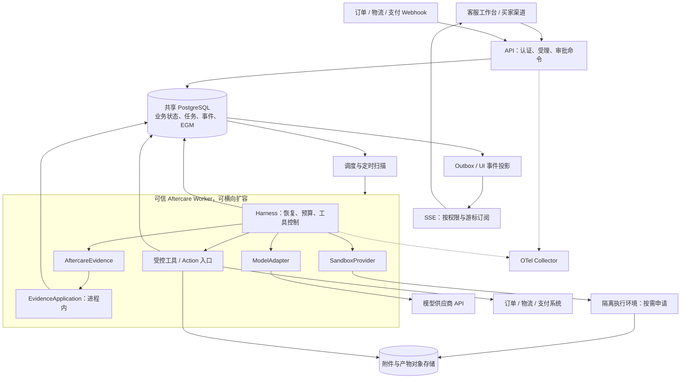
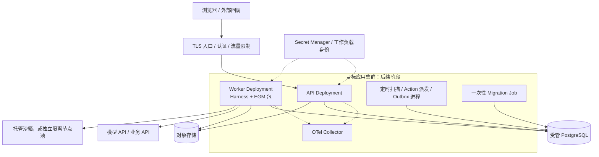
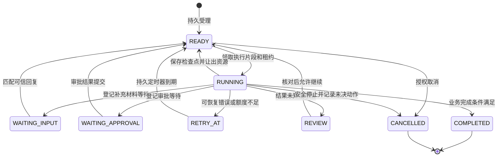
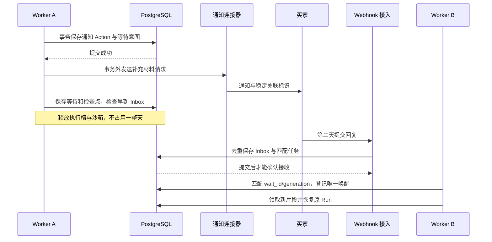
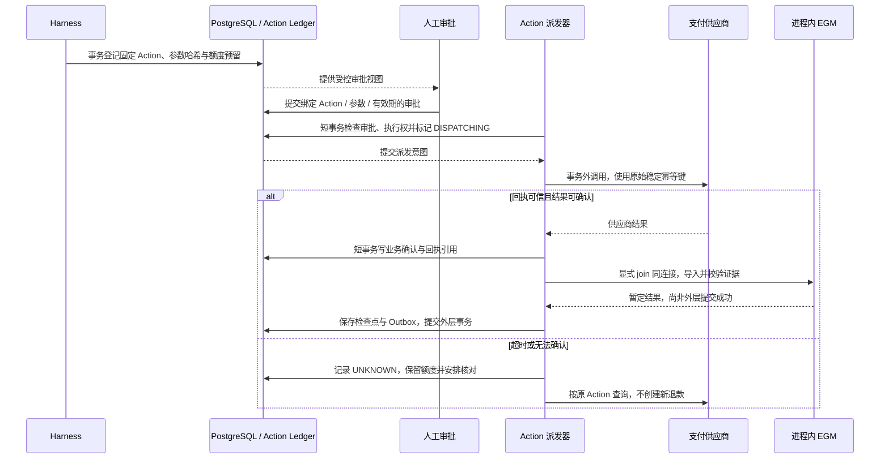
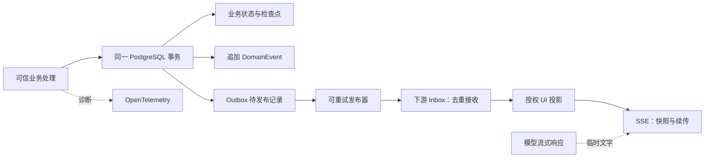
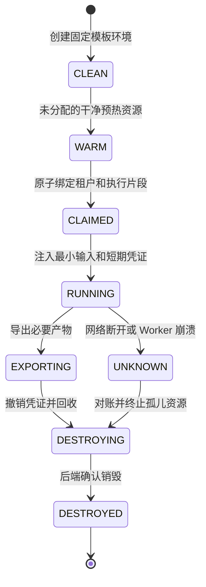

# Aftercare Agent 工程总设计：部署、运行时、事件、沙箱与记忆

本文回答“这个项目接下来到底怎样建”。更新日期：2026-09-12（当前进度以状态台账为准）。

已提交源码基线：Aftercare 的最新提交和远端状态以[状态台账](project-status.md)及 Git 日志为准；EGM `9c7c5d196f8e703fdc7c70546cff0dc94cc78dcd`，源码版本 0.6.0，未发布 PyPI。本轮已重新运行隔离 PostgreSQL 验收并完成开发 Compose smoke；没有部署生产服务器。

文中的“选择”“设计”“需要”表示拟建设的系统，不表示已经有对应服务、真实供应商或生产压测结果。当前已实现的是可恢复运行时骨架、证据账本/适配垂直切片和 EGM 存储/应用层；它们与完整业务运行时的边界见第 2 节。

阅读关系：本篇是工程落地蓝图；[完整技术文章](architecture.md)解释背景和原理；[嵌入式接入](integrations/egm-embedded.md)说明当前可调用接口；[ADR-0002](decisions/0002-embedded-egm.md)固定 EGM 的部署决策。

开始实现或上下文压缩后，从[状态台账](project-status.md)恢复事实，再看[执行计划](engineering-plan.md)的对应任务。语言/版本/目录选择见[技术栈](tech-stack.md)。实时进度只在状态台账维护，本文不另建完成清单。

## 1. 总体选择：服务端运行的售后系统，里面有 Agent

我们建设的是一个能处理中断、等待和并发的售后业务系统。模型负责理解买家描述、调查矛盾、阅读材料和提出方案；确定性代码负责身份、订单归属、金额、审批、执行权和结果确认。

例如，“买家说没收到货，物流却显示签收”会触发调查。Agent 查询订单与物流、分析签收截图、请求补充信息，可能等待一天，再提交补发或退款建议。真正的退款只能通过授权的业务入口，不能因为模型写了“已解决”就结束工单。

第一版的技术方向明确如下。它是选型决策，不是已部署清单：

| 层 | 默认选择 | 主要理由与边界 |
|---|---|---|
| 业务服务 | Python 3.13 + FastAPI；模块化代码，API/Worker 分进程 | 先保留清晰边界，不按每个模块拆微服务 |
| 客服工作台 | TypeScript + React + Vite，A3 引入 | 客户端展示与交互，后端保留业务执行权 |
| 持久状态 | PostgreSQL + psycopg；显式迁移、受控连接池 | Case、Run、Action、等待与任务可同事务变化 |
| Agent 控制 | Aftercare 自有 Harness，有限执行片段 | 业务恢复不能依赖聊天请求或模型 SDK 的内存循环 |
| 证据记忆 | Worker 内嵌 EGM EvidenceApplication | 复用现有保护逻辑；HTTP 是可选入口 |
| 初始队列 | PostgreSQL 任务表、Inbox、事件表、Outbox | 第一版不强制同时引入 Kafka、NATS 和 Redis |
| 模型接口 | OpenAI Responses 首个适配器；Messages 可替换 | 业务状态自管；具体模型 ID 经任务集评测后固定 |
| 文件与产物 | S3 兼容对象存储 | 大附件不塞进任务表，不依赖 Pod 本地文件 |
| 不可信工具 | SandboxProvider；先做模拟，再接 E2B 或自建 K8s 后端 | 是否允许托管出网必须先确认，沙箱不是每个任务的常驻配额 |
| 客户端进度 | HTTPS 命令 + SSE 事件订阅 | 断线与后台任务生命周期解耦 |
| 观测 | OpenTelemetry Collector + 指标/追踪后端 | 诊断与业务审计分开，不把遥测当主账本 |

### 总体架构图

这是目标逻辑架构，不是每个框都要成为一个独立服务。Worker 内的几个框表示进程内模块。



最重要的边界：模型在供应商侧推理，Harness 在我们的可信服务器进程中运行，不可信脚本在沙箱中执行，长期业务状态在 PostgreSQL 中。四者不是同一个“Agent 进程”。

## 2. 哪些已经有，哪些不能写成已经完成

| 状态 | 内容 |
|---|---|
| 已具备 | 固定 Python/EGM 的包与锁文件、离线测试和构建入口；不是完整服务启动入口 |
| 已具备 | domain 中的运行时/调查 v1 类型与纯规则；不是数据库执行权、真实鉴权或 EGM 调查接入 |
| 已实现 | AftercareEvidence 的 register_refund、ingest_receipt、propose_completion、context |
| 已实现 | EGM 公共应用层的权限、工单范围、输入验证、schema 指纹、幂等、revision 与审计 |
| 已实现 | SQLite/真实 PostgreSQL 两个后端，以及显式 join 宿主事务 |
| 已实现 | 固定退款完成声明，失败回执与绑定错配的门控；不是自由事实文本 |
| 已实现（骨架） | API、Session/Case/Run/Step/Attempt、Fake Harness、Worker、等待、检查点与 PostgreSQL 调度队列 |
| 已实现（骨架） | Action Ledger、跨工单 business key 幂等、租约/fencing、执行槽与重试预算、审批参数绑定、派发 fail-closed 门禁和绑定 Wait 的原子唤醒；审批 API 与真实业务连接器仍待实现 |
| 已实现（边界） | Responses 解析/预算、SSE 持久回放、OIDC claims 转换、OTel tracer 边界、Fake 沙箱；真实模型、live tail、JWKS、E2B/Kubernetes 和生产压测仍待实现 |
| 未承诺 | 数据库 HA、RLS、保留删除、备份恢复体系、真实退款 exactly-once |

当前 [evidence.py](../aftercare_agent/evidence.py) 的 propose_completion 通过时，只说明固定的完成声明获得证据支持。它没有实现 Case 关闭，也没有封装节点 transition。EGM 的 transition 是另一项受权限约束的接口，后续由可信业务编排调用。

此前文档记录的 EGM 303 passed / 2 skipped 和 Aftercare 4 passed 是已有版本的验收记录，不是本文新增设计全部通过测试的证明。

## 3. 服务器、容器、Pod：分别是什么

服务器提供 CPU、内存、网络与磁盘。容器是应用交付和进程隔离方式。Pod 是 Kubernetes 调度单位。Case 是业务数据，Run 是逻辑运行，Session 是交互上下文。它们之间不存在天然的一一对应。

一个 Worker 容器可以在受限并发下处理多个 Run 的执行片段。一个 Run 可以先后由不同 Worker 接手，也可以使用零个、一个或多个沙箱。一个等待两天的 Run，不需要两天都占据一个 Worker、Pod 或浏览器。

### 开发、试点和规模化的部署顺序

开发阶段用 Docker Compose 表达 API、Worker、PostgreSQL、对象存储兼容服务和必要观测组件。API 与 Worker 可以来自同一个 Aftercare 镜像，用不同入口命令；EGM 固定提交构建成依赖包，装入 Worker 镜像，不部署必选 EGM 服务。当前仓库已有开发 Compose 与 API/Worker 镜像，但仍需在 Linux/目标环境做完整启动验收。

首个生产试点，我倾向于“应用容器 + 受管 PostgreSQL + 受管对象存储”。应用可以先在少量 Linux VM 或容器平台运行，数据库不依附应用容器的临时磁盘。若只有一台应用服务器，要明确它仍有单机故障域，不能把自动重启称作高可用。

已有团队 Kubernetes 运维条件，或试点证明需要更多节点、独立伸缩与自建沙箱后，再采用下图。数据库可以继续在集群外；不必为使用 K8s 把所有有状态组件搬进 StatefulSet。



Kubernetes Deployment 适合可替换的持续运行副本；Job 适合迁移、回填等运行至完成的工作。Job 仍可能重试或重复启动，不提供外部付款只执行一次的保证。[Deployment](https://kubernetes.io/docs/concepts/workloads/controllers/deployment/)、[Job](https://kubernetes.io/docs/concepts/workloads/controllers/job/)

发布流水线按：测试 → 构建不可变镜像 → 漏洞/秘密扫描 → 迁移验证 → staging 冒烟与故障测试 → 灰度 → 观察 → 扩大。记录镜像 digest、Aftercare/EGM 提交、Prompt、Schema、工具与模板版本。迁移用专用身份执行，运行账号不具有 DDL 权限。数据库采用 expand/contract 兼容迁移，代码回滚不等于数据库自动降级。

容器以非 root、最小权限运行；仅明确目录可写，不挂载宿主 Docker socket。数据库连接、模型密钥由可信宿主使用；部署 Secret 对象本身不是完整秘密管理。SIGTERM 后停止领取新任务，在有限期限内保存检查点并排空，无法安全完成的操作由租约与 Action 核对接管。

## 4. Session、Agent、Case、Run 应该怎样建模

第一版约定一个业务 Session 绑定一个 Case；一个 Case 可以有买家邮件、客服网页等多个 Session。将来允许跨案件导航时，也必须显式切换范围，不复用不受限的上下文。

| 对象 | 生命周期与内容 | 不是 |
|---|---|---|
| Tenant | 商家/组织与访问边界 | 模型自行填写的字符串 |
| Session | 一段渠道交互，含参与人和消息引用 | HTTP 连接、供应商 response_id |
| Case | 持久售后案件，含订单、证据、处理状态 | Python 对象或一段聊天历史 |
| AgentDefinition | 版本化提示、工具集、策略、预算与模型配置 | 为每位用户常驻的一份模型权重 |
| Run | 围绕明确目标的逻辑运行，可跨长等待 | 必须一直存活的进程 |
| Step | 一项逻辑工作及其输入/输出契约 | 每次重试都变成新工作 |
| Attempt | Step 的一次实际尝试与执行记录 | 重新退款的授权 |
| Action | 稳定外部操作、参数摘要、审批、幂等键、结果 | 临时 tool_call_id |
| 执行片段 | Worker 持有执行权的一段有限工作时间 | 整个工单的生命周期 |

关系可以概括为：Case 有多个 Session 和 Run；Run 有多个 Step；Step 有多个 Attempt。Action 独立于 Attempt，允许多个调查 Run/Case 引用同一笔已登记操作。

用户发来新消息不一定立即新建 Run：同一目标的补充资料可以满足原 Run 的等待；原 Run 已结束或目标变化，则创建关联前序的新 Run。保留初始触发和输入版本，不原地篡改历史。

所谓“启动 Agent”，实际是 Worker 读取 AgentDefinition 和 Run 检查点，构建本轮上下文、调用模型并执行受控工具。不同 Run 的对话数组、工具闭包、预算和凭证不可复用；模型 API 客户端可按 SDK 线程安全契约共享，案件状态必须独立。

## 5. Harness：外层持久状态机，内层有限工具循环

不预先把全部调查路径写死成一张巨大 DAG。业务关键节点确定化，调查片段允许模型动态选择只读工具。第一版只设一个主调查 Agent；附件分析等确有独立输入输出时再拆辅助角色，不为了“多 Agent”复制规划器。

Harness 的职责是：恢复检查点、确认执行权、装配上下文、预算控制、模型调用、完整工具请求校验、工具权限分发、持久化结果、登记等待和产出解释。Prompt 只是其中一项。



图中是拟实现的 Run 状态，不是 EGM TaskNode 的同名映射。取消交互、Run 取消、Case 关闭、外部退款撤销也是不同事情。

一次执行片段分成三个阶段：

1. 短事务领取任务，确认租户/Case/Run，增加 fencing token，保存租约和 Attempt 意图，然后提交。
2. 在事务外读检查点、申请限额、调用模型与只读工具，必要时申请沙箱。完整响应持久化之前，不执行模型提出的副作用工具。
3. 重新进入短事务，核对执行权和业务版本，保存结果引用、检查点、等待/后继任务及领域事件。需要时显式 join EGM，再由外层提交。

无论使用什么 SDK，都不在数据库事务里等待模型、浏览器、对象上传、付款请求或人工回复。同步 EGM/psycopg 调用不可阻塞整个异步 Worker 事件循环；使用有上限的数据库执行线程/工作槽，并保证连接在同一调用上下文内正确借还。不能为几千个等待工单一直保留几千条连接。

一次片段同时有墙钟、模型轮数、工具次数与费用预算。额度不足、等待时间较长或达到片段上限时，持久化下一次可运行时间并让出资源。只读独立工具可有限并行；依赖工具按依赖执行，写工具走 Action 入口。

检查点至少含 Run/Step/Attempt、业务版本、fencing、完整协议记录引用、已执行工具结果、Action 引用、证据与策略版本、剩余预算、等待代次和下一项工作。EGM context 是其中的证据输入，不是整个检查点。

## 6. 并发控制：执行权、容量、数据冲突要分开

### 三种不同的约束

- 执行权：当前谁能推进这个 Run，由 Aftercare 租约与 fencing 决定。
- 资源准入：还有多少模型、数据库、供应商和沙箱容量，由限额与调度决定。
- 提交一致性：当前状态是否仍是预期版本，由业务 version、EGM revision、行锁和唯一约束决定。

EGM 的 Case 行锁只覆盖短操作。同一工单读取目前也要锁，不同工单可以独立推进；这不代表系统拥有无限吞吐或公平调度。

初始队列表保存 tenant、run、available_at、priority、attempt_count 和领取状态；Run 行保存权威 lease_owner、lease_until 和单调递增的 fencing_token。队列项只是唤醒提示，不能各自给同一个 Run 发一把独立的锁。Worker 在短事务中领取提示，并原子取得对应 Run 执行权；重复唤醒合并或转入重新判断，不能同时推进同一 Run。PostgreSQL 的 SKIP LOCKED 可用于队列表领取，但不会自动提供公平性、严格 FIFO 或重试策略。[PostgreSQL locking clause](https://www.postgresql.org/docs/current/sql-select.html)

### 心跳与旧 Worker

心跳用于续租，progress 用于判断是否有进展，deadline 用于强制限制运行时间。进程还活着、TCP 还连接着、沙箱还存在，都不能代替有效执行权。

领取和续租使用数据库时间。受保护写入先锁住权威 Run 行，检查 owner、fencing、租约未过期及业务版本，锁一直持有到检查点和状态提交；等价的原子条件更新也可以。普通 SELECT 检查后再写，即使在同一事务里，也不能自动实现 fencing。旧 Worker 即使恢复，也不能覆盖新持有者状态。所有触及业务行、订单行和 EGM Case 行的路径要统一锁顺序，避免循环等待。

fencing 无法撤回已经发出的供应商 HTTP 请求。迟到但真实的回执可以进入可信的只追加接入通道，由当前执行者核对；失去租约的旧 Worker 不因此恢复推进业务的权限。

### 不要填写一个万能并发数

分别控制：全局活跃片段、每租户片段、每 Case 写入、模型 RPM/TPM、供应商账户请求、数据库连接、沙箱资源和附件处理 CPU。

用队列年龄、限流比例、池等待时间、执行耗时和失败恢复时间调参。I/O 等待为主的 Worker CPU 可能不高，单纯按 CPU 扩容不能发现真正瓶颈。HPA 可使用资源、自定义或外部指标，但需要指标管道和对应容量预算。[HPA](https://kubernetes.io/docs/concepts/workloads/autoscaling/horizontal-pod-autoscale/)

数量关系只用于容量估算：在稳定负载且口径一致时，活跃片段数约为片段到达率乘平均占用时间。工单总持续时间含一天人工等待，不能拿来直接计算所需 Worker。预热也不能增加供应商配额；更换消息系统不会自动增加模型吞吐。

## 7. 长等待、Session 断开与第二天恢复

不要用一个 await 或 sleep 保存“等客户回复”。等待应成为持久对象：wait_id、run_id、generation、类型、关联键、条件版本、deadline、状态与满足它的事件 ID。



图中是正常顺序，实际回复可能早于等待激活。我们采用“两边都可恢复”的设计：登记/激活等待时查已提交 Inbox；接收回复时也保存持久匹配任务；定期扫描未匹配事件。只查一次 Inbox 会遗漏恰好晚提交的回复。

回复与超时竞争同一个 wait_id/generation，只有仍在 WAITING 的那一代可以成功转换。初版选“第一个合法事务提交成功”为分支依据，超时处理前重新检查已提交 Inbox。迟到回复仍保留并触发复核，不丢弃，也不隐式复活旧代次。若业务要求以严格接收截止时间判断，要另外实现可信接入时间和宽限策略。

一个输入可以供多个消费者使用，因此 Inbox 去重与每个消费者的应用记录分开保存。不能用全局 processed=true 表示所有下游都处理完毕。

满足等待的条件转换、消费者应用记录、唯一后继唤醒任务和对应领域事件必须在一个事务内提交。先标记“已满足”再异步创建任务，会在两步之间崩溃时永久丢失唤醒。唯一约束绑定 wait_id/generation，Run 执行权仍由 Run 行控制。

## 8. Action Ledger：避免两张工单退同一笔钱

Case 级别串行还不够：两个不同 Case 可以关联同一订单。退款必须在订单/支付聚合范围核对，并保留稳定业务操作键。

建议业务键由 tenant、商家支付账户、payment_id、refund_obligation_id 和必要的分次退款 installment_id 构成，并设置数据库唯一约束。退款义务来自可信规则/人工确认，不能由模型随机生成。相同业务键且规范化参数哈希一致才返回原 Action；金额、币种等不同必须报冲突并重新走业务授权，不能把旧结果冒充新申请完成。不同合法义务也要共同校验可退款余额。

Action 保存规范化参数哈希、审批、政策版本、金额币种、稳定供应商幂等键、状态和回执。Action 独立于 Attempt；重试不是换个 action_id 再调用一次。

Action 自身也有版本与派发代次，派发器只从允许状态原子领取并转换到 DISPATCHING。回执核对与异常处理检查当前版本/代次；迟到的超时不能把已确认成功的 Action 降回 UNKNOWN。Run 租约不会自动保护跨 Run 的 Action 派发竞争。

登记或预留额度的短事务锁定支付聚合，核对“已确认退款 + 尚未释放的预留额度 + 本次申请”不超过允许额度。DISPATCHING 与 UNKNOWN 仍占预留额度，不能因为超时就释放额度。若人工或其他系统能绕过该入口退款，还必须核对权威支付状态，单靠本地锁无法约束所有渠道。

### 授权、执行、确认的时序



这里 EGM 的作用是核验证据支持，不是发起退款。供应商成功以后 EGM 导入失败，不能把已经发生的付款抹掉。可先保存业务确认并记录投影待补；如果选择 joined 严格原子事务而整体回滚，恢复时仍要按原 Action 向供应商核对，不能把本地回滚解释成外部未执行。

审批绑定对象、参数摘要、金额、币种、身份、策略版本和有效期。执行前重新检查。既无幂等又无可靠查询的供应商，结果未知时必须人工核对；没有一种队列或数据库事务能凭空补出这一保证。

## 9. 四种事件流：不要混成一个“Agent Event Bus”

模型正在输出文字、业务已经完成退款、浏览器正在展示进度、运维正在分析延迟，是四种不同的事实。

| 流 | 内容 | 持久性与恢复职责 |
|---|---|---|
| 模型协议流 | 文本 delta、工具参数片段、完整响应项 | delta 可临时展示；完整工具请求和必要协议项进入检查点 |
| 业务事件流 | CaseOpened、InputReceived、ApprovalGranted、ActionConfirmed | 在业务事务内持久记录；驱动可靠处理与审计 |
| 客户端展示流 | 正在调查、需要审批、已确认完成等授权投影 | SSE 按游标重连；恢复已提交状态，不承诺重放每个 token |
| 遥测流 | trace、span、metric、诊断日志 | 用于诊断；可能采样、丢失，不代替业务账本 |

### 业务事件和页面输出的路径



第一版没有外部 Broker 时，“发布器到 Inbox”可以是本库中的持久交接；不能因此取消去重、重试和投影检查点。事件表也不等于完整 Event Sourcing：我们先以业务表为权威状态，事件提供已提交变化的解释与分发，不承诺所有表都能仅靠历史事件重建。

建议事件信封如下，示例值是包含后续 Action 的目标说明，不是现有 API。当前 A0 的字段与纯校验以[运行时契约 v1](contracts/runtime-v1.md)为准：

```json
{
  "event_id": "evt_example",
  "schema_version": 1,
  "tenant_id": "tenant_example",
  "case_id": "case_example",
  "case_seq": 42,
  "run_id": "run_example",
  "action_id": "action_example",
  "type": "ActionConfirmed",
  "occurred_at": "2026-09-06T08:00:00Z",
  "causation_id": "evt_previous",
  "correlation_id": "workflow_example",
  "trace_id": "trace_reference",
  "payload_ref": "authorized_receipt_reference"
}
```

tenant_id 来自可信授权边界；payload_ref 必须通过当前用户和 Case 权限解引用。不要把完整买家地址、支付凭证和附件正文复制到每个事件与遥测系统。

### 游标必须能处理提交乱序

数据库自增 ID 是分配顺序，不保证事务提交顺序。事务 A 先取得 100 尚未提交，B 取得 101 先提交；订阅方若把“最大 ID 101”当作已消费水位，之后可能永久漏掉 100。PostgreSQL sequence 还不随事务回滚回收。[PostgreSQL sequence 说明](https://www.postgresql.org/docs/current/functions-sequence.html)

我们的 Case 事件序号由 Case 行上的事务性计数器分配，在相同短事务中持有行锁直至事件与状态提交。同 Case 的事件因此按该边界串行；它与业务 version 分开，不能假定一次状态变化只产生一条事件。

若要跨 Case 的工作台全局游标，另设 UI 投影自己的 stream head 和事务性序号；源事件通过可重试、去重的投影过程进入这条展示流。此时顺序表示“进入展示流的顺序”，不是全球业务发生顺序。不要直接用 EGM audit 的 identity ID 充当全租户可靠游标。

并行发布还可能让同 Case 的 42 先于 41 到达。投影必须保存每 Case 已应用序号：旧事件去重，缺口先持久暂存并从权威事件表补读，按连续序号应用；不能用晚到旧事件覆盖新状态。投影更新、展示流追加和消费者应用记录同事务提交。源事件已归档时，改用一致快照及其对应水位重建，不把缺口当作已处理。

SSE 首次连接返回一致的投影快照与对应游标，重连从游标后读取，并每次检查权限。超出事件保留窗口时要求重新获取快照，不能静默跳过。Outbox 发布器按待发送状态领取记录，不按一个全局 MAX(id) 跳过较早未提交的数据。

游标还绑定租户、订阅范围和授权版本。权限或筛选范围变化时重新建立授权快照与游标，移除失权数据，并补齐新获得权限的 Case；不能继续沿用旧游标而漏掉新可见案件。游标只是定位信息，不是访问授权凭证。

### ACP 放在哪里

这里的 ACP 指 Agent Client Protocol，不是另一个同缩写协议。它可以成为客户端与 Agent 的可选交互适配器：session/prompt 提交输入，session/update 发送进度，权限请求交互提供前端入口。它不是持久任务队列，也不替代企业审批台账、执行权和恢复机制。[ACP Prompt Turn](https://agentclientprotocol.com/protocol/v1/prompt-turn)

第一版网页用 HTTPS 命令和 SSE 就够了。未来如果要接支持 ACP 的桌面客户端，再把同一业务命令与授权投影映射到 ACP；不能让客户端点了一次“允许工具”就等同于支付审批。

## 10. PostgreSQL、Kafka、NATS、Redis：先解决语义，再换基础设施

初版选择 PostgreSQL，原因不是它在所有负载下最好，而是业务状态、等待、任务、Inbox 和 Outbox 可以放进同一提交边界，先把最难验证的故障语义做正确。

即使共用数据库，也要区分这些对象：task 是可领取工作，event 是已发生事实，outbox 是待交付记录，inbox 是接收记录，consumer application 是某消费者已经应用某输入的证明。不能一张表加一个 processed 字段就替代全部生命周期。

| 系统 | 适合何时引入 | 它没有替我们解决什么 |
|---|---|---|
| PostgreSQL 任务/事件表 | 初始垂直切片、事务一致性优先、团队希望减少组件 | 索引、清理、锁竞争、公平调度和轮询成本仍需设计 |
| Kafka | 已有企业事件平台，或需要大规模保留、回放和多个独立消费者 | 分区顺序不是跨分区全序；Kafka 内事务不覆盖支付 HTTP |
| NATS JetStream | 需要独立持久消息层、拉取消费、确认与重投 | 消息去重和确认不让任意外部业务操作自动只执行一次 |
| Redis Streams | 已有运维基础，消费组与待确认列表符合需求 | Pending 接管、持久化与故障恢复配置、业务幂等仍由应用承担 |

这些系统的交付、事务与恢复语义应按所选版本核对，不能仅凭产品名宣称 exactly-once。[Kafka 设计](https://kafka.apache.org/43/design/design/)、[JetStream 交付与确认](https://docs.nats.io/learn/jetstream/delivery-and-acknowledgment)、[Redis Streams](https://redis.io/docs/latest/develop/data-types/streams/)

使用外部消息系统后的可靠路径是：业务事务提交 Outbox → 发布器发送并等待持久确认 → 消费者把消息去重写入 Inbox 和后续持久任务 → 数据库提交成功 → ACK。ACK 表示该层已完成可靠交接，不代表整个数天工单结束。发布成功但本地没来得及标记，允许重复发布；消费者必须能处理重复。

采用至少一次交付配合幂等状态转移，明确 UNKNOWN 操作的核对流程，比泛称“全链路 exactly-once”更可验证。毒消息进入隔离/死信状态并告警，不无限占据队头；重试有上限、退避和抖动。人工重放保留原事件 ID、因果链与操作键，不绕过权限。

什么时候迁移？看任务领取延迟、数据库 CPU/I/O、锁等待、事件保留成本、消费者数量和团队运维能力的实测，不预设一个没有依据的 TPS 门槛。换 Broker 只替换可靠分发层，不改变 Run、Action、等待与租约的业务语义。

## 11. 沙箱：把危险计算移出去，而不是把整个企业系统搬进去

### Harness in service 是本项目默认方案

可信 Aftercare Worker 保存 Harness，能够访问受限业务接口、连接池与进程内 EGM。模型生成的 Python、第三方网页、可疑 PDF/表格解析、浏览器脚本在沙箱中执行。常规订单查询、租约续期、审批核验和证据入库不需要进入沙箱。

Harness in sandbox 则是在隔离环境中运行完整 Agent 执行器。它适合需要完整终端、文件系统和现成 CLI 的任务，也可以让其通过受限 RPC 请求可信后端。代价是还要解决执行器状态导出、凭证边界和沙箱消失后的恢复。它不是错误方案，但本项目没有必要为复用 Coding Agent CLI 而改变售后控制面的安全边界。

因此，我们不会把装了 Codex 的容器直接称为 Aftercare 业务平台。真正的差异是 Case 生命周期、审批、操作台账、持久等待、租户隔离和证据准入，而不是它有没有聊天窗口。此前提到的 Grok Bot 等产品的公开能力边界见[专门研究](research/sandbox-harness-grok.md)；不把产品演示推断成其内部部署事实。

### E2B 与 Kubernetes 不在同一抽象层

E2B 提供可通过 API 创建、使用和管理的隔离执行环境。Kubernetes 是容器编排底座；Kubernetes Agent Sandbox 在其上增加沙箱资源、模板和预热池等生命周期机制。具体隔离还取决于节点运行时与安全配置，单装 CRD 不会使普通 Pod 自动拥有虚拟机级隔离。[E2B Sandbox](https://docs.e2b.dev/sandbox)、[Kubernetes Agent Sandbox](https://github.com/kubernetes-sigs/agent-sandbox)、[RuntimeClass](https://kubernetes.io/docs/concepts/containers/runtime-class/)

落地顺序：先实现 FakeSandboxProvider 做确定性测试；允许把已脱敏材料交给托管环境的试点，可以首先接 E2B；明确要求执行环境留在企业基础设施内时，选择自建 Kubernetes Agent Sandbox，并评估 gVisor/Kata 等隔离运行时。这里没有承诺任意 E2B 部署方式都满足客户的数据驻留要求。

两种后端都必须通过同一个窄接口，业务代码不直接调用各家生命周期 API。建议接口职责为：allocate、execute、export_artifact、inspect、terminate；每次请求绑定 tenant、case、run、sandbox lease、模板版本、资源预算与能力集合。远端执行还需稳定 execution_id；不能在网络超时后立即创建另一台沙箱重跑不明状态任务。

分配前先持久化 allocation_id，并把它写入后端可检索元数据。Provider 必须支持真正幂等的分配，或按这个标识发现资源，不能只支持已知 sandbox_id 的查询。创建响应丢失时维持 UNKNOWN 和容量预留，由 Reconciler 查找；若发现重复环境，只选定一个合法绑定，其余撤销凭证并回收。接入不具备这些能力的后端前，需要设计替代对账入口，不能宣称自动回收验收已经可实现。

### 沙箱生命周期与预热



预热减少启动延迟，不等于增加模型额度、CPU 上限或退款吞吐。预热池保存未绑定用户的干净环境；使用后的环境默认销毁，不直接归还跨租户池。需要保留浏览器登录态时，必须设计专属租户隔离、到期撤销与加密存储，不能把已有客户 Cookie 写进公共模板。

预热量可从“预计新增沙箱到达率 × 补池耗时”估算，再结合突发余量、可用区、模板分布和成本压测调整。这是容量模型，不是给所有企业写死一个默认池大小。预热空闲资源也占后端额度；配额应同时计入启动中、运行中和待回收资源。

资源释放不能只靠 Python finally：Worker 可能被直接杀掉。数据库记录分配意图、后端标识、绑定关系、过期时间与状态；独立 Reconciler 定期与后端核对。只有确认回收或按明确异常策略处置后，才释放相应容量预留，防止记录显示空闲而后端已经堆满孤儿沙箱。短期凭证到期提供额外保护，不能代替回收。

### 隔离必须落实到权限和网络

沙箱没有 PostgreSQL 连接、EGM 裸对象、高权限 Principal、支付主密钥或 Worker 环境变量副本。只能读取指定输入，输出到指定对象前缀；临时凭证限制对象、动作和有效期。客户端可见的文件引用同样必须重新授权。

执行限制覆盖 CPU、内存、进程、磁盘、运行时长和输出大小；网络采用明确的出口策略，阻止云 metadata、内网管理面和未授权地址。浏览器访问和 URL 跳转都要考虑 SSRF 与 DNS 重绑定，不能仅在首次 URL 字符串上检查域名。不得挂宿主 Docker socket 或开放任意特权容器。

附件先进入隔离对象区域，保存内容哈希、来源与扫描状态。沙箱生成的“退款成功报告”仍是不可信计算结果，不能被连接器重新标成支付供应商回执。可信等级由入口身份和证据类型决定，不由文件名或模型自述决定。

大文件与必要产物进入对象存储；数据库只保留引用、哈希、权限、保留期和出处。沙箱快照不能代替业务检查点，恢复快照也不会撤销已经发生的外部动作。

## 12. Agent Memory：分层保存，不把所有东西塞进向量库

本项目至少有五类“记忆”，不能互相顶替：

| 层 | 保存什么 | 权威与作用 |
|---|---|---|
| 业务主状态 | 订单、Case、审批、Action、退款余额 | 业务规则决定合法变化 |
| 运行检查点 | Run/Step/Attempt、等待、完整工具调用和恢复所需协议项 | Harness 决定从哪里继续 |
| EGM 证据层 | 原始证据、引用、受支持声明、任务解释图与审计 | 证明某声明为何可被接纳 |
| 长期知识/偏好 | 有来源的偏好、经审核 SOP、有效版本政策 | 改善后续上下文，不授予操作权 |
| 当前模型上下文 | 本轮必要事实、任务约束和工具结果 | 有限窗口中的工作材料，不是最终账本 |

### 现有 EGM 如何接入

Worker 内的 AftercareEvidence 调用 EvidenceApplication。当前适配器的四个方法分属不同信任角色：

1. register_refund：可信编排器用业务台账登记预期租户、工单、订单、动作、金额和币种。
2. ingest_receipt：可信连接器提供回执和真实观察时间，保留来源约束。
3. propose_completion：实际方法接收节点、证据引用、operation_id 与 expected_revision。拟对模型开放的工具包装只允许选择授权节点与证据引用，操作 ID 和预期 revision 由宿主绑定；使用固定完成声明，不能自由改订单、金额或事实正文。
4. context：在授权 Case 中提取上下文，默认不混入长期记忆。

“同一个类上有这些方法”不表示应该把整对象暴露给模型。工具注册必须是明确白名单；高权限对象只能由可信编排和连接器持有。客户上传的截图不能走支付连接器身份。

EGM PostgreSQL 后端以 egm_cases 保存 tenant/case 范围和 revision，egm_records 保存独立带类型的对象行，egm_operations 保存幂等操作回执，egm_audit 保存审计，egm_schema_version 标记数据库迁移版本。这不是把整个 SQLite 文件打包存进 PostgreSQL；但部分对象数据使用 JSONB，也不能称所有领域字段都已完全关系规范化。

同一 Case 使用短事务与行锁，不同 Case 可独立推进；当前同 Case 读取也会串行。普通嵌入调用自己管理事务，只有显式 join 才加入宿主同连接外层事务。joined 返回结果在外层提交前是暂定的；不能提前 ACK 消息或向客户端宣布已持久完成。具体接口、版本与限制见[嵌入式指南](integrations/egm-embedded.md)。

当前 PostgreSQL 检索是 Case 内的子串查询，不是向量检索或 FTS5 排名替代品。上下文结果条数限制也不等同于大规模查询已经优化，需要实际数据量下检查查询和索引。存储层没有自动提供数据库 HA、RLS、不可篡改审计、保留删除或备份恢复。

### 证据新鲜度与业务历史不能混淆

现有退款 Schema 对订单/动作/金额/币种等进行绑定，对失败状态和陈旧证据施加门控。这仍不替代退款资格判断：是否允许退款、剩余额度、政策适用和审批由业务系统决定。回执币种字段的格式验证，也不代表业务完成了全部货币和支付渠道校验。

证据过期表示它可能不能再支持一个要求“当前有效”的新声明，不意味着已经确认的历史退款被撤销。历史 Action、原始回执和当时决策应保留；若需要新判断，则补查权威来源。不能把旧回执重新盖上当前时间来绕过新鲜度。

EGM 接纳完成声明以后，可信业务代码仍要确认 Action、审批、未决步骤与 Case 关闭条件。EGM revision 只保护 EGM 对象变化，不是 Run 执行租约，也不跨 Case 阻止重复退款。

### Letta 或其他记忆系统何时有用

当前不同时引入 EGM、Letta 和 TencentDB Agent Memory。先用 EGM 解决证据准入，用业务库解决持久事实与运行恢复。未来出现跨会话偏好、长周期知识管理等明确需求，再评估专门记忆系统；已有资料与边界见[ACP 与记忆研究](research/memory-acp.md)。

引入长期记忆时，记录 tenant、适用对象、来源、可信等级、政策版本、有效期和撤回状态，默认不开跨租户检索。政策变化必须使旧知识失效或降级，不能让“过去退过一次”成为“现在允许退款”的授权。

每轮上下文由当前目标、政策版本、业务快照、必要 Session 消息、未决 Action、授权证据摘要和模型协议状态组成。超长内容先保留可授权检索的原文引用，再生成可追溯摘要；摘要错误不能覆盖原始回执。所有长期状态独立于 Worker 和沙箱寿命。

## 13. 模型 API：先接 Responses，但业务状态始终由我们控制

### 修正之前那句过度简化的对比

“Responses 适合平台托管执行流、Messages 适合应用层状态机”可以描述某些使用偏好，但不能当作两种接口的能力边界。

Responses 的 function_call / function_call_output 是结构化调用与返回，应用可以保存上下文、执行自己的工具循环；previous_response_id 或 Conversations 是可选状态管理方式。Messages 的 tool_use / tool_result 同样是结构化块，不是在 message.content 里猜半结构化文本。两者都能构建应用自管状态机。[OpenAI Function Calling](https://developers.openai.com/api/docs/guides/function-calling)、[OpenAI Conversation State](https://developers.openai.com/api/docs/guides/conversation-state)、[Anthropic 工具调用](https://platform.claude.com/docs/en/agents-and-tools/tool-use/handle-tool-calls)

供应商侧 web search 等内置工具与我们的本地 function tool 也不是同一种执行边界。不能看到 web_search_call 就假定应由本地 Worker 再执行一次搜索。适配器要区分供应商已执行工具的结果和应用需要处理的工具请求。

### 本项目的具体选择

首个模型协议适配器使用 Responses，原因是结构化工具调用和事件消费路径适合当前计划，也便于明确区分本地工具与供应商工具。不是因为 Messages 无法审计，更不是因为 Responses 能替我们实现多天售后工作流。

业务工具默认由 Aftercare 自己执行。模型只能提出受 Schema 限制的工具意图；服务端在完整参数到齐后做结构、权限、对象绑定、预算和状态检查，才进入工具入口。流式参数未收齐不能执行工具；strict schema 不能代替业务授权。退款工具优先暴露“提交处理建议/请求审批”，不向调查模型暴露任意支付调用。

ModelAdapter 统一请求、文本输出、完整 ToolIntent、用量和错误分类，同时保存恢复所需的供应商原生协议项与版本。不能只存一段最终文字或几个抽象 tool name，丢掉 call_id、内容块关系和必要的不透明协议数据。保存协议材料不等于索取或展示模型私有思维链。

默认由应用管理必要上下文和持久检查点；若所用能力允许，显式设置 store=false。它不等于零数据保留、不出网或符合所有企业隐私要求，具体还取决于账户数据控制、端点能力和日志策略。跨境数据、客户附件与敏感字段必须经过独立审查。[OpenAI 数据控制](https://developers.openai.com/api/docs/guides/your-data)

API Key 在可信服务器侧，沙箱只拿任务限定能力。模型侧 response_id 可以用于关联调用，但不是 Case ID、租约或退款幂等键。模型供应商的后台执行能力也不能替代我们的审批、长等待和灾难恢复。

### 为什么现在不拍脑袋指定“最强模型”

协议可以先确定，模型 ID 需要在真实售后任务集上评测后固定。选择指标包括工具参数正确率、证据引用支持率、权限越界尝试、中文/多语言理解、恢复后的重复动作、延迟和单案件成本；不能只比通用榜单。

初期只设一个主模型配置，避免路由放大排错复杂度。之后可为纯分类/摘要增加低成本配置；复杂调查和高风险建议使用评测更好的配置，但任何模型都不能替代确定性规则和人审。每次运行记录模型、Prompt、工具 Schema 和政策版本。

供应商失败时，只有在安全检查点上才能换适配器继续；先把已经提交的业务事实和工具结果读回来。跨供应商不强行搬运不兼容的隐藏协议状态，也不能把某次付款当成“模型请求重试”重新执行。

## 14. 心跳、可观测性与运维安全

“心跳”至少有四种，必须给它们不同的职责：

| 信号 | 说明什么 | 不说明什么 |
|---|---|---|
| 进程健康探针 | 进程是否响应、是否适合接新流量 | 不证明正在持有某 Run 的执行权 |
| Run/资源租约续期 | 在数据库规则下继续持有特定执行资格 | 不证明已经退款，也不延长用户审批 |
| 任务进度检查点 | 逻辑步骤已推进到哪里 | 不代表底层进程一直存活 |
| 持久定时器/扫描 | 等待、重试和对账到了处理时间 | 不要求一个线程不断 sleep |

Worker 可以存活但没有推进进度，模型调用也可能长时间无输出。因此分别检测失去租约、无进展、调用超时和预算耗尽。readiness 不宜简单依赖每个外部模型 API 的瞬时状态，避免供应商抖动使全部业务入口同时被摘掉。

### OpenTelemetry 的作用

每个有限执行片段建立 trace 或 span 组，记录排队、模型、工具、数据库、EGM 门控与沙箱启动耗时。跨消息、跨天恢复使用 correlation 与 span links 关联，不维持一个持续三天的活跃 span。OTel 描述因果与耗时，业务事件和审批台账记录必须保留的事实。[OpenTelemetry Traces](https://opentelemetry.io/docs/concepts/signals/traces/)

重点指标是就绪任务最老等待时间、租约冲突/接管数、UNKNOWN Action 积压及年龄、模型限流和成本、数据库池等待、沙箱启动/回收失败、人工等待时间以及最终解决质量。

case_id、run_id 等高基数标识放入受控日志/追踪或业务查询，不直接变成无限增长的指标标签。默认不记录完整 Prompt、买家 PII、工具密钥和附件；需要调试时使用授权、脱敏、时限与留存策略。遥测采样可以漏诊断样本，业务审计不能因此漏审批记录。

### 安全与恢复是上线条件

接入层验证 Webhook 签名、时间窗口、租户与事件去重；API 使用真实认证和 Case 授权，不能信任请求体中的 tenant_id。队列中的对象引用同样需要在执行时重新校验。模型读取的买家邮件、网页与文件属于数据，不能变成系统指令或工具权限。

数据库和对象存储分别有最小权限、加密、备份、恢复演练及保留删除策略。EGM 当前有审计记录，不代表数据库管理员无法修改记录；需要更强合规性质时，另设受保护的审计归档、访问控制和验证机制。

上线前明确 RPO/RTO、不可逆动作的人工接管流程和变更回滚路径。部署高可用数据库之前先演练实际恢复；只有“备份成功日志”不等于能恢复服务。

## 15. 模块与实施顺序：先证明一个闭环能恢复

代码继续放在 Aftercare 仓库；EGM 仍独立发版和依赖。当前 evidence.py 和 domain 的纯契约已存在，下表其余运行模块仍是计划，不是已有服务清单。

| 文件/模块方向 | 责任 |
|---|---|
| aftercare_agent/evidence.py（已有） | 受控 EGM 适配层 |
| api/、auth/ | 受理、查询、审批、Webhook 与权限 |
| domain/、persistence/ | Case/Run/Action/Wait、约束、迁移、事务边界 |
| runtime/ | Harness、领取、fencing、检查点、恢复与预算 |
| connectors/、actions/ | 可信来源、派发、供应商幂等和结果核对 |
| model_adapters/ | Responses 首个实现、协议状态和错误归一化 |
| events/ | Inbox、Outbox、消费者去重、UI 投影与 SSE |
| sandbox/ | Provider、模板、额度、短期凭证和孤儿回收 |
| observability/ | OTel、指标、脱敏诊断与关联 |
| deploy/compose/、deploy/k8s/ | 后续可运行部署配置与运维说明 |

模块划分不等于微服务划分。API 与 Worker 分别扩容，后台任务初期可以同一个镜像用不同入口运行。只有明确需要不同故障域、权限或伸缩曲线的部分才进一步拆进程/服务。

### 阶段 A：可靠的只读调查闭环

目标：受理真实形状的输入，查询模拟订单/物流，生成可追溯建议，等待补充材料，杀掉 Worker 后从另一实例恢复。

阶段 A 分成四个可验收小阶段，详细任务以[执行计划](engineering-plan.md)为准：A0 固定包/依赖、业务契约和合成案件；A1 实现最小 PG/API/Worker、FakePlanner 和基础租约/fencing，并交付最小 Compose；A2 验证等待、Inbox/Outbox、两个 Worker 的崩溃恢复；A3 再接 Responses、调查证据与最小工作台。

现有 EGM 适配器只有退款回执切片，A3 必须新增订单/物流/买家陈述的调查契约，不能把 refund_completed 原样用于调查。A 阶段不真实退款、补发或发送邮件；补充材料请求只是草稿/模拟记录，回复由合成输入驱动。若要提前真实外发，必须先补上对应动作的幂等、派发和结果未知核对，不能绕过阶段 B 的业务门禁。

验收：多租户、多 Case 并发互不串上下文；重复输入不重复推进；回复早到、长等待、Worker 崩溃与页面断开都可恢复。第一版 UI 能查看 Case、等待原因、证据引用、动作草案和事件时间线。

### 阶段 B：受控的业务动作

新增 Action Ledger、支付聚合约束、审批、派发、UNKNOWN 核对与故障注入。先对模拟供应商和供应商测试环境验证，再决定试点动作范围。对业务主状态与 EGM 要么显式 join，要么明确采用可恢复投影；不能默认它们会自动同事务。

验收：同一业务义务跨 Case 也只登记一次；不同义务不超余额；审批参数变化后旧审批失效；外部成功但本地未提交不会触发第二次退款；未知结果不被误判失败。

### 阶段 C：按需沙箱与运维试点

实现 FakeSandboxProvider，再接选定真实后端、对象存储、预热和 Reconciler；补齐资源层并发和 OTel。最小 Compose 在 A1 已作为目标交付，本阶段扩展隔离环境与试点配套，不把开发启动环境拖到沙箱接入之后。沙箱模块可在 A2 基础上与 B 并行开发，含真实业务动作的试点仍需 B 验收。需要 K8s 时固定控制器、CRD、运行时与模板版本，不直接应用未经验证的 main/latest 示例。

验收：沙箱崩溃、超时、孤儿、凭证到期和租户隔离可测试；有可解释成本与启动延迟数据；附件不能通过沙箱越权进入可信证据入口。

### 阶段 D：生产准入与有依据的扩展

补齐数据库/对象恢复、灾备、留存删除、供应商真实限额、持续评测、压测与安全检查。根据瓶颈决定是否增加专用 Broker、自动伸缩或长期记忆系统，而不是先把全部组件装齐。

EGM 依赖从文档固定提交构建包并固定在锁文件/镜像中，之后再切正式版本发布。不能在容器启动时临时 git pull main。模型、工具、数据库与沙箱版本一起进入发布清单。

## 16. 故障验收矩阵与当前结论

下列是完整 Aftercare 的待建验收，不是已经跑过的测试。已有 EGM PostgreSQL 并发、事务和门控测试只能证明其中的组件边界。

| 注入场景 | 必须观察到的结果 |
|---|---|
| 同一个 Webhook 重投多次 | 一个 Inbox 输入；每消费者至多一次合法状态应用 |
| 两个 Worker 争用同一 Run | 一个有效执行权；过期持有者不能提交状态 |
| 旧 Worker 在新租约建立后返回 | 旧逻辑写入被拒绝；可信外部观察可经独立入口接纳 |
| EGM revision 冲突 | 重新读取并判断，不把它当作持有 Run 租约的证明 |
| 模型工具参数只流出一半后断线 | 工具未执行；记录不完整调用并安全恢复 |
| 买家回复早于 WAITING 激活 | 已提交 Inbox 与等待最终匹配，不永久丢唤醒 |
| 回复、超时和旧代次回调竞争 | 按 wait_id/generation 只选择一个合法分支，保留迟到输入 |
| 同一退款义务来自两个 Case | 引用同一 Action；不同合法义务仍受支付余额约束 |
| 供应商成功但响应丢失 | UNKNOWN 保留额度，按原操作核对，不创建新退款 |
| join 写入后宿主事务回滚 | 业务和 EGM 本地写入均回滚，消息未提前 ACK |
| Outbox 发布后进程崩溃 | 允许重复发布，下游去重，不丢失已提交变化 |
| 事件 ID 分配和提交乱序 | UI 游标和 Outbox 扫描均不漏事件 |
| 沙箱创建成功但 Worker 未记完状态 | Reconciler 按关联标识发现并接管/回收，不无限漏资源 |
| Worker/POD 在等待期间被删除 | 等待记录仍在；新 Worker 恢复原逻辑 Run |
| 输入中含伪造系统指令或租户 ID | 不升级权限，不改变证据来源，不读他人 Case |
| 数据库或对象存储从备份恢复 | 达到约定 RPO/RTO，并核对恢复点之后的外部动作 |

这个项目的核心不是选一个更大的 Agent 框架，而是建立几条可验证的不变量：业务状态可恢复，执行资格可撤销，危险动作可核对，证据不能越权，等待不长期占资源，组件升级不破坏契约。

第一步应交付“能够跨 Worker 崩溃恢复的售后调查闭环”，而不是一个包含所有组件、却无法证明不会重复退款的部署图。
